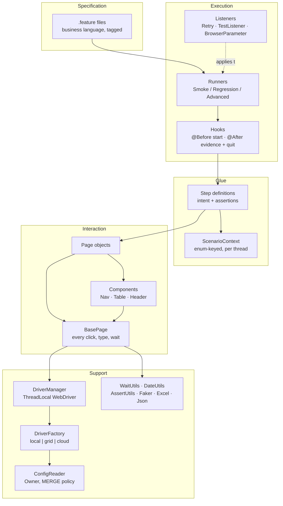
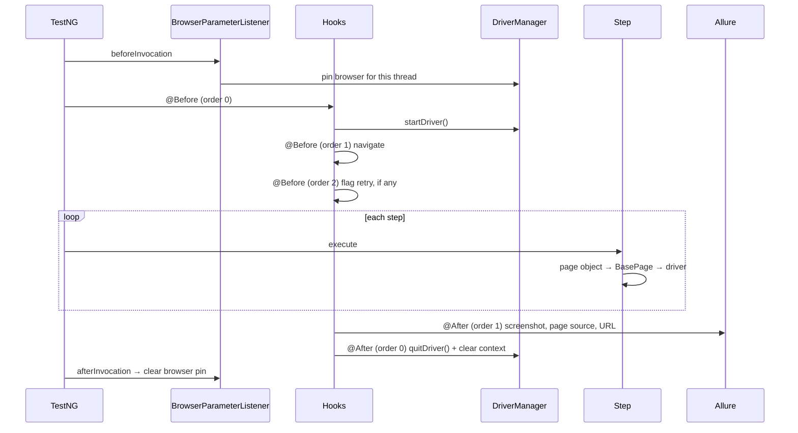

# Selenium Automation Framework

A hybrid BDD + data-driven Selenium framework: Cucumber as the specification layer, Page Objects
as the interaction layer, TestNG as the execution engine — running scenarios in parallel against a
Dockerised Selenium Grid, with retry, flakiness reporting and Allure history wired into CI.

Application under test: [ParaBank](https://parabank.parasoft.com/parabank), Parasoft's public
banking demo.

[](https://www.selenium.dev/)
[](https://cucumber.io/)
[](https://testng.org/)
[](https://openjdk.org/)
[](https://maven.apache.org/)
[](https://allurereport.org/)
[](https://www.selenium.dev/documentation/grid/)
[](https://github.com/Adarsh89P/selenium-automation-framework/actions/workflows/selenium.yml)

---

## Contents

- [Engineering decisions](#engineering-decisions)
- [Architecture](#architecture)
- [Project layout](#project-layout)
- [Getting started](#getting-started)
- [Running the suite](#running-the-suite)
- [Suites](#suites)
- [Configuration](#configuration)
- [Reporting](#reporting)
- [Continuous integration](#continuous-integration)
- [Known gaps](#known-gaps)

---

## Engineering decisions

Nine choices that shape the framework, and the reasoning behind each.

### 1. The driver is a `ThreadLocal`, and there is no static `WebDriver` anywhere

`DriverManager` holds one driver per thread. There is no static driver field and no setter that
accepts a driver from outside the framework, so a scenario physically cannot reach into another
scenario's browser session. That is what makes parallel execution safe rather than merely
configured.

Two details matter more than the `ThreadLocal` itself:

```java
public static void startDriver() {
    if (DRIVER.get() != null) {
        // A leaked driver would silently leak a browser process; fail loudly instead.
        throw new IllegalStateException(
                "A driver is already active on thread " + Thread.currentThread().getName()
                        + ". quitDriver() was not called after the previous scenario.");
    }
    DRIVER.set(DriverFactory.create());
}
```

**It fails loudly on a leaked driver.** Silently overwriting the slot would orphan a browser
process per scenario until the machine ran out of memory, and the eventual failure would point
nowhere near the hook that forgot to clean up.

**`remove()` is in a `finally` block.** Not `set(null)` — TestNG hands pool threads to the next
scenario, and a thread holding a dead driver fails the following scenario in a way that looks like
a page bug:

```java
try {
    driver.quit();
} finally {
    DRIVER.remove();
}
```

### 2. Zero implicit waits, permanently

`DriverFactory.applyCommonSettings` never calls `implicitlyWait`, and the reason is in a comment
so nobody helpfully adds one:

> mixing implicit and explicit waits makes timeouts unpredictable

When both are active, the implicit wait applies inside every `findElement` an explicit wait polls
with, so a 10s explicit wait over a 10s implicit wait can block for far longer than either number
suggests — and the arithmetic differs by driver. Every wait in the framework is explicit and
bounded by `explicit.timeout` (default 20s).

Timeout and polling configuration is read in exactly one place, `WaitUtils`, which `BasePage`
delegates to. A page cannot quietly use a different timeout.

### 3. `ScenarioContext` is keyed by an enum, so a typo is a compile error

Cross-step state lives in a per-thread map, not in step-class fields — instance fields on step
classes are the usual reason a suite cannot run in parallel and the usual reason scenarios start
depending on each other.

```java
/** Keys are an enum rather than loose strings, so a typo is a compile error. */
public enum Key {
    LOGGED_IN_USERNAME, LOGGED_IN_PASSWORD, NEW_CUSTOMER,
    SOURCE_ACCOUNT, TARGET_ACCOUNT, NEW_ACCOUNT_NUMBER,
    BALANCE_BEFORE, TRANSFER_AMOUNT, PAYEE, LOAN_OUTCOME, PROFILE_BEFORE
}
```

A `String`-keyed context fails at runtime, one scenario at a time, with a null that surfaces three
steps later. This fails at `javac`. The context is wiped by the `@After` hook in a `finally`, so a
reused pool thread always starts empty.

### 4. Configuration merges four sources, highest wins

Owner's default `FIRST` load policy would stop at the first source that opens — and
`system:properties` always opens, so no properties file would ever be read. `MERGE` loads every
source and lets the first one holding a given key win:

```
-Dkey=value  >  environment variable  >  <env>.properties  >  config.properties
```

Credentials therefore never need to be committed: exporting `APP_PASSWORD` overrides whatever the
file says, which is how CI supplies secrets.

### 5. Retries are global, and a retried pass is never silently green

`RetryTransformer` attaches `RetryAnalyzer` to every test through `IAnnotationTransformer`. No test
carries `@Test(retryAnalyzer = ...)`, so a scenario cannot be written without retry protection —
or without the reporting that comes with it.

Two things about `RetryAnalyzer` are less obvious than they look:

**The attempt counter is a `ConcurrentHashMap`, not an `int` field.** TestNG creates one analyzer
per `ITestNGMethod`, not per invocation, and every Cucumber scenario arrives through the *same*
method (`runScenario`) fed by a data provider. A plain field would be shared by every scenario in
the suite — two scenarios failing on two threads would eat each other's budget, and the increments
would race. Invisible serially; guaranteed once `data-provider-thread-count` exceeds 1.

**An `AssertionError` is not retried.** A deterministic assertion failure fails identically on
attempt two, so retrying buys a slower red build — and where the failure is an intermittent
*product* bug, the retry is exactly what turns it green. Retries exist for stale elements, socket
resets and page-load timeouts. Override with `-Dretry.only.infrastructure.failures=false`.

Retried tests are recorded as flaky in three places: a `FLAKY` warning per test, an end-of-run
block, and `target/flaky-report.txt` (published to the GitHub job summary). Allure groups both
attempts under one `historyId`, so its Retries tab shows the failed attempt and its reason without
any help from the framework.

### 6. Dates are computed from an injectable `Clock`

A scenario searching "between 01-01-2024 and 31-12-2024" passes for a year and then fails forever —
and fails *silently correctly* first, returning nothing because the window slid into the past
rather than because anything broke. Every date comes from `DateUtils`, relative to now.

The clock is injectable because a date utility built on `LocalDate.now()` cannot be unit tested:
its correct answer changes daily, so the test either asserts nothing or reimplements the logic it
is checking. Pinned to a known Friday, "one business day from now" has exactly one right answer:

```java
private static final Clock FRIDAY =
        Clock.fixed(Instant.parse("2026-09-04T10:00:00Z"), ZoneId.of("UTC"));

@Test
public void businessDaysSkipTheWeekend() {
    DateUtils.withClock(FRIDAY);
    assertThat(DateUtils.businessDaysFromNow(1)).isEqualTo(LocalDate.of(2026, 9, 7));
}
```

### 7. Locators live only in pages and components; steps express intent

Three boundaries, enforced by review rather than tooling:

| Layer | Owns | Never contains |
|---|---|---|
| `features/` | business language | UI mechanics |
| `steps/` | intent, assertions | locators, waits, `WebDriver` |
| `pages/`, `components/` | locators, interactions | assertions |

Locator priority is id → name → CSS → XPath, and every XPath carries a comment explaining why the
DOM left no alternative. Page methods return page objects or domain records, never `WebElement`.

### 8. `AssertUtils` adds what AssertJ cannot express, and nothing else

There is no `assertEquals` or `assertTrue` wrapper — steps use AssertJ directly and read better for
it. What the library cannot do in a browser suite is covered:

- **`assertAmountsEqual`** — `new BigDecimal("25.00").equals(new BigDecimal("25"))` is **false**;
  `equals` compares scale as well as value. An app rendering "25" where the test computed "25.00"
  fails an equality assertion while being entirely correct, and the message reads like a product
  bug. The most common way a banking suite lies.
- **`eventually`** — re-reads a value until it settles, for state that arrives asynchronously and
  that no page object should know about. Throws `AssertionError`, so a value that never settles is
  a verdict rather than something retried into a slower red.
- **`softly`** — soft-assertion failures attached to Allure, so "3 of 6 fields did not persist"
  reaches the report and not just a stack trace.

### 9. Cross-browser parallelism needs a listener, not just a suite XML

One `<test>` block per browser looks sufficient and is not: `DriverFactory` reads the browser from
a single JVM-wide `-Dbrowser`, and a TestNG `<parameter>` never reaches it — so all three blocks
would quietly run Chrome and the suite would report cross-browser coverage it never had.

`BrowserParameterListener` reads each block's parameter in `beforeInvocation`, which runs on the
very thread about to execute the scenario, and pins a `ThreadLocal` override that `DriverFactory`
consults ahead of config. `afterInvocation` clears it, because that pool thread goes to the next
scenario. A silently wrong green is worse than a missing feature.

---

## Architecture



Scenario lifecycle:



---

## Project layout

```
selenium-automation-framework
├── docker-compose.yml               Grid 4 hub + chrome/firefox/edge nodes, health-gated
├── Jenkinsfile                      declarative, parameterised on browser/tag/env/threads
├── .github/workflows/selenium.yml   @smoke on PRs, nightly @regression on the grid
└── src/test/
    ├── java/com/adarsh/
    │   ├── core/          DriverFactory · DriverManager · BrowserType · ExecutionTarget
    │   │                  ScenarioContext (enum-keyed, per-thread)
    │   ├── config/        FrameworkConfig (Owner, MERGE) · ConfigReader
    │   ├── pages/         BasePage + 9 page objects
    │   ├── components/    AccountServicesNav · AccountsTable · HeaderComponent
    │   ├── domain/        records: AccountSummary · Customer · LoanOutcome · Payee · TransactionRow
    │   ├── steps/         9 domain-grouped step classes — no locators, no waits, no WebDriver
    │   ├── hooks/         Hooks: driver lifecycle, evidence capture, retry flagging
    │   ├── runners/       BaseCucumberRunner + Smoke · Regression · Advanced
    │   ├── listeners/     RetryAnalyzer · RetryTransformer · TestListener · BrowserParameterListener
    │   └── utils/         WaitUtils · DateUtils · AssertUtils · ExcelReader · JsonReader
    │                      FakerUtils · ScreenshotUtils
    └── resources/
        ├── features/      8 feature files, 21 scenarios
        ├── config/        config.properties · dev.properties · stage.properties · log4j2.xml
        ├── suites/        testng-smoke · testng-regression · testng-advanced · parallel-grid
        ├── testdata/      login-credentials.json · payees.json
        └── META-INF/services/org.testng.ITestNGListener   listener registration
```

`META-INF/services` matters: listeners registered there attach to **every** suite automatically. A
`<listeners>` block has to be copied into each new suite XML, and the first time someone forgets,
that suite runs without retries, without failure evidence — and still reports green.

---

## Getting started

**Prerequisites**

| | |
|---|---|
| JDK | 25 (Temurin) |
| Maven | 3.9+ |
| Browser | Chrome, Firefox or Edge — drivers resolved by Selenium Manager, no WebDriverManager |
| Docker | only for the Grid and cross-browser suites |

```bash
git clone https://github.com/Adarsh89P/selenium-automation-framework.git
cd selenium-automation-framework
mvn test -Psmoke
```

No driver binaries to download and nothing to configure: Selenium Manager resolves the driver, and
the default environment points at the public ParaBank demo.

---

## Running the suite

```bash
# Suites
mvn test -Psmoke                     # PR gate
mvn test -Pregression                # full suite + unit tests
mvn test -Padvanced                  # Selenium 4 specific scenarios

# Browser and visibility
mvn test -Psmoke -Dbrowser=firefox
mvn test -Psmoke -Dheadless=false

# Environment
mvn test -Pregression -Denv=stage

# By tag — overrides the profile's tag expression
mvn test -Dcucumber.tags="@regression and @transfer"
mvn test -Dcucumber.tags="@smoke and not @wip"

# Concurrency (overrides the value in the suite XML)
mvn test -Pregression -Ddataproviderthreadcount=8

# Against a Dockerised Grid
docker compose up -d --wait
mvn test -Dexecution=grid -Dsurefire.suiteXmlFiles=src/test/resources/suites/parallel-grid.xml
docker compose down -v

# Report
mvn allure:report && mvn allure:serve
```

---

## Suites

| Suite | File | Contents | Concurrency |
|---|---|---|---|
| Smoke | `testng-smoke.xml` | `SmokeRunner` — `@smoke and not @wip` | 4 |
| Regression | `testng-regression.xml` | unit tests first, then `RegressionRunner` | 4 |
| Advanced | `testng-advanced.xml` | `AdvancedRunner` — Selenium 4 features | 2 |
| Cross-browser | `parallel-grid.xml` | regression × chrome, firefox, edge | 6 |

Two notes on parallelism, both learned the hard way:

**Cucumber-TestNG does not parallelise through `parallel="methods"`.** Every scenario arrives as one
row from `@DataProvider(parallel = true)` in `BaseCucumberRunner`, so `data-provider-thread-count`
is the only attribute with any effect. Setting `parallel="methods"` looks like it works and changes
nothing.

**The regression suite runs unit tests first, deliberately.** They are browserless and sub-second;
a broken domain invariant should fail in seconds rather than twenty minutes into a browser run.

Scenario coverage:

| Feature | Scenarios | Tags |
|---|---|---|
| `authentication.feature` | 6 | `@smoke` `@regression` `@wip` |
| `registration.feature` | 3 | `@smoke` `@regression` |
| `accounts.feature` | 2 | `@smoke` `@regression` |
| `transfer-funds.feature` | 2 | `@smoke` `@regression` |
| `bill-pay.feature` | 2 | `@smoke` `@regression` |
| `find-transactions.feature` | 2 | `@regression` |
| `loans.feature` | 2 | `@regression` |
| `profile.feature` | 2 | `@regression` |

---

## Configuration

Precedence, highest first:

```
1. -Dkey=value          command line
2. environment variable how CI supplies secrets
3. <env>.properties     selected by -Denv=dev|stage
4. config.properties    shared baseline
```

| Key | Default | Purpose |
|---|---|---|
| `base.url` | ParaBank demo | application under test |
| `app.username` / `app.password` | demo values | overridable by `APP_USERNAME` / `APP_PASSWORD` |
| `browser` | `chrome` | `chrome` \| `firefox` \| `edge` |
| `execution` | `local` | `local` \| `grid` \| `cloud` |
| `headless` | `true` | |
| `window.width` / `window.height` | 1920 × 1080 | fixed, so screenshots are comparable across runs |
| `explicit.timeout` | 20s | bounds **every** wait in the framework |
| `page.load.timeout` | 40s | |
| `polling.interval.millis` | 250 | |
| `grid.url` | `http://localhost:4444/wd/hub` | |
| `retry.max` | 2 | a test needing three attempts is broken, not flaky |
| `retry.only.infrastructure.failures` | `true` | never retry an `AssertionError` |
| `cloud.url` / `cloud.username` / `cloud.accesskey` | empty | env vars only, never committed |

No credentials are committed. The demo values are public sandbox data that resets periodically;
both are overridable by environment variable so the same suite can point at a private deployment
without editing a file.

---

## Reporting

| Output | Location |
|---|---|
| Allure results | `target/allure-results/` |
| Allure report | `target/site/allure-maven-plugin/` |
| Cucumber HTML | `target/cucumber-report.html` |
| Flaky tests | `target/flaky-report.txt` |
| Per-scenario logs | `target/logs/scenarios/<scenario>.log` |
| Screenshots | `target/screenshots/` |

On failure, `Hooks` captures a screenshot, page source and URL **while the session is still
alive** — TestNG's `onTestFailure` runs after the browser has been quit, which is why the Cucumber
evidence lives in the hook rather than the listener. `TestListener` adds the browser console log
for TestNG-native tests, enabled by the `goog:loggingPrefs` capability set in `DriverFactory`
(Chromium only; Firefox exposes no console log over W3C WebDriver).

Logging is routed per scenario by a Log4j2 `Routing` appender keyed on an MDC value the hooks set,
so concurrent scenarios produce one readable file each instead of one interleaved mess.

---

## Continuous integration

**GitHub Actions** — `.github/workflows/selenium.yml`

| Trigger | Job |
|---|---|
| pull request, push to `main` | `@smoke`, headless Chrome, no Grid |
| nightly cron (02:30 UTC) | full `@regression` across three browsers on the Dockerised Grid |
| `workflow_dispatch` | either, with tag and environment inputs |

Every reporting step carries `if: always()` — a suite that fails and uploads nothing is worse than
one that never ran, because the evidence exists in the runner and is about to be discarded.
`always()` is attached only to steps that publish, never to one that could mask a failure.

The grid is started with `docker compose up -d --wait`, which blocks until the hub is healthy *and*
the nodes have registered. A node answers its own health check seconds before it reaches the hub,
and a suite started in that window fails with "Could not start a new session" — a failure that
reads like a test bug and is not one.

Allure history is carried forward from the `gh-pages` branch before the report is generated, then
republished, so the trend graph spans runs instead of resetting nightly.

**Jenkins** — `Jenkinsfile`

Declarative and parameterised on `BROWSER` (including `all`), `EXECUTION`, `ENVIRONMENT`, `TAGS`,
`THREADS` and `HEADLESS`. A validation stage rejects `BROWSER=all` with `EXECUTION=local` in
seconds rather than after the grid has been pulled. The `post` block archives evidence and tears
down the grid whether the suite passed, failed or was aborted.

---

## Known gaps

Stated plainly, because a framework that claims to be finished is not being honest.

- **`docker-compose.yml`, the GitHub workflow and the Jenkinsfile have not been executed
  end-to-end.** They need Docker, GitHub and Jenkins respectively. What they depend on is verified
  locally: the suite files, `-Dsurefire.suiteXmlFiles`, `-Dcucumber.tags`,
  `-Ddataproviderthreadcount`, and a two-browser probe confirming each `<test>` block drives its
  own browser. The Jenkinsfile carries `// TODO`s for the agent label, tool installation names and
  credential id, which cannot be guessed correctly.
- **`parallel-grid.xml` is unrun** for the same reason — Firefox is not installed on the
  development machine and there is no Grid there.
- **Video recording and `--scale` are mutually exclusive.** A `selenium/video` recorder binds to
  one node by container name, so `--scale chrome=3 --profile video` records the first node and
  ignores the rest. Doing both needs Selenium's Dynamic Grid, a different deployment model.
- **No `@advanced` scenarios exist yet.** `AdvancedRunner` and its suite are in place; relative
  locators, CDP network interception, console-log assertions and new-window handling are not
  written.
- **No data-provider layer.** `ExcelReader` and `JsonReader` exist, but there is no
  `@DataProvider` bridge feeding TestNG-native data-driven tests from them.
- **No API layer.** Every scenario sets up its own data through the UI, which is slower and
  couples setup to the pages under test.
- **ParaBank has no two-role approval flow**, so the framework has no scenario exercising one
  user's action being approved by another. That is a limitation of the application, not the
  framework, and it is the strongest argument for moving to a richer AUT.
- **`@wip` scenario**: a locked-account login case is tagged and excluded — ParaBank exposes no way
  to lock an account, so it cannot be automated against this application.

### What I would add next

1. The data-provider layer, so bulk regression matrices come from Excel and JSON rather than from
   `Examples` tables.
2. A Rest Assured client to seed and clean test data without the UI.
3. The `@advanced` scenarios, which are the clearest demonstration of Selenium 4 over Selenium 3.
4. Spotless, Checkstyle and Jacoco in CI, with coverage gates on `utils/` and `core/`.

---

## Licence

MIT — see [LICENSE](LICENSE).
